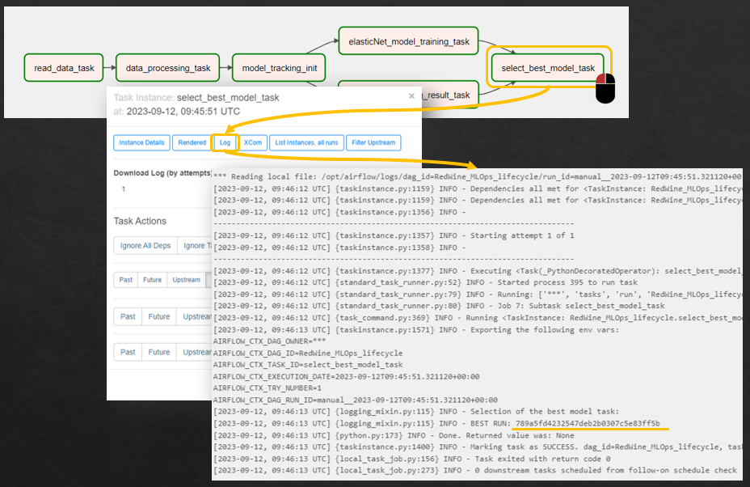

# MLOPS EDGE ARCHITECTURE

**Still working on.** This document provides a guide on setting up the MLOps Edge architecture to carried out the model inference. It covers the steps required to deploy the architecture and offers some instructions on how to use it.

The architecture has been dockerized to improve management and deployment efficiency. It employs a Docker Compose setup, enabling a seamless integration of various components necessary for the MLOPS project. This approach simplifies the management of services and provides a unified environment for deploying services, ensuring a smooth workflow throughout the project lifecycle.


## INSTALLATION AND CONFIGURATION GUIDE

1. **Update the `.env` file with your desired configuration parameters.**

    > **NOTE**  
    If you intend to deploy the project on a machine different from your local development environment (e.g., not using localhost), please follow these steps:
    > 1. Update IP Address in the `.env` file
    > 2. Configure Docker Network `docker-compose.yml` file. Locate line 26 which likely includes `external: true`. Comment this line by adding a # at the beginning. Uncomment line 28 which likely includes `driver: bridge` by removing the # at the beginning.

2. **Include the code for performing model inference in the `app/main.py` file.**

2. **Build and start the docker-containers.** To this end, inside the directory *Edge* run the following commands:

    ```
    docker-compose build
    docker-compose up
    ```


## Usage

In a new terminal outside the docker container open a python terminal runing the following command. 

```
python3
```


Then, run the inference task. You can use the following example:

```
import requests

data = {
    "datos" : "{'fixed acidity':6.2,'volatile acidity':0.66,'citric acid':0.48,'residual sugar':1.2,'chlorides':0.029,'free sulfur dioxide': 29,'total sulfur dioxide': 75, 'density': 0.98, 'pH': 3.33, 'sulphates': 0.39, 'alcohol': 12.8}",

    "model" : "<MODEL_RUN_ID>"    # Model identifier
}

resp = requests.get(url = 'http://<Server_IP_or_localhost>:381/predict',params = data)
resp.text
```

**IMPORTANT**: 
1. Update `MODEL_RUN_ID`: Currently it should be defined manually. You can use the one that appear in the logs of the task 'select_best_model_task' in airflow, which corresponds to the id of the best model obtained.

2. Update `Server_IP_or_localhost` with the IP of the machine or localhost, i.e. `http://localhost:381/predict`. In addition, if the inference is going to be done inside a docker container service in the same docker-compose.yml the ip adress can be replaces as follows: `http://edge_inference:381/predict`.